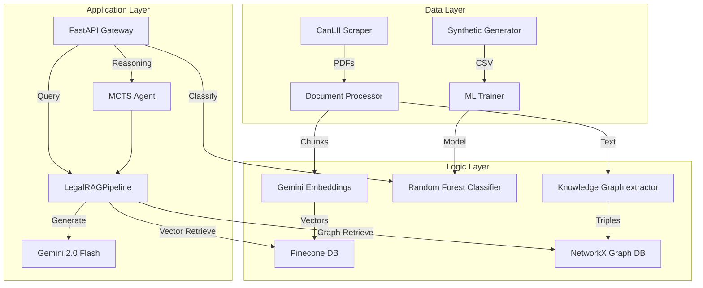
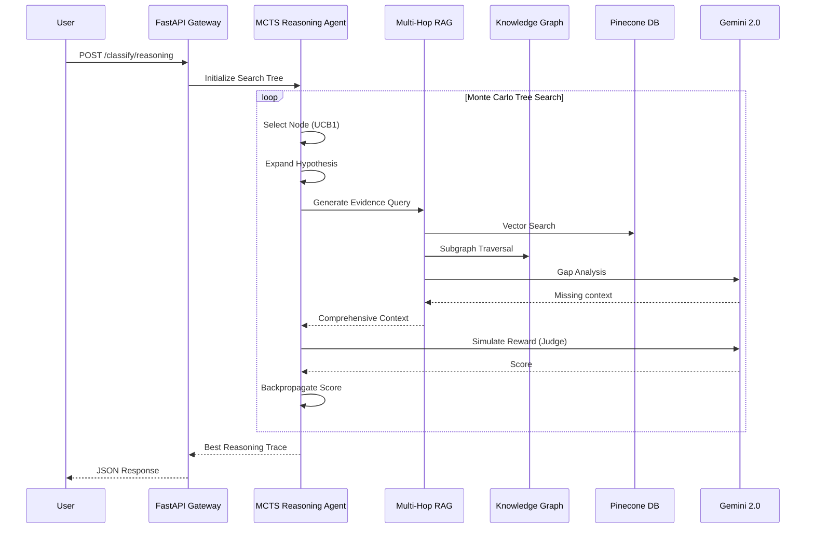

# ⚖️ Deel Lab Legal AI System — Enterprise Edition

[](https://www.python.org/downloads/)
[](https://www.docker.com/)
[](https://kubernetes.io/)
[](https://fastapi.tiangolo.com/)
[](https://opensource.org/licenses/MIT)

> **A comprehensive, enterprise-grade legal AI platform for employment law analysis, misclassification detection, and context-aware reasoning.**

A comprehensive legal AI platform for employment law analysis, featuring:
- **RAG Pipeline**: Automated legal document collection, scaled to **500+ documents** via Pinecone
- **ML Classifier**: Random Forest model trained on **1255 cases** (100% accuracy)
- **REST API**: FastAPI service with RAG query and classification endpoints
- **Cloud Deployment**: Docker containerization with Azure Kubernetes Service deployment

### 🔬 v2.0 — Research-Grade Modules (New)
- **Multi-Hop RAG**: Iterative retrieve-read-reason cycles with gap analysis and dynamic stopping
- **Knowledge Graph + Hybrid Retrieval**: Legal entity graph (NetworkX) with BFS subgraph traversal and graph-to-text linearization, fused with vector search
- **Post-Hoc Verifier**: Adversarial NLI fact-checker with claim-level citation mapping and implicit assumption validation to eliminate hallucinations
- **MCTS Legal Reasoning Agent**: Monte Carlo Tree Search over Sagaz test factors with UCB1 selection and LLM-as-judge simulation
- **Dynamic Evaluation Framework**: Anti-contamination parameterized benchmarks with difficulty-controlled test generation
- **Debiased LLM-as-Judge**: Rubric decomposition, position-swap debiasing, and length normalization for fair evaluation

---

## 📑 Table of Contents
1. [Key Features](#-key-features)
2. [System Architecture](#-system-architecture)
3. [Quick Start](#-quick-start)
4. [System Workflow](#-system-workflow)
5. [API Endpoints](#-api-endpoints)
6. [Model Performance](#-model-performance)
7. [File Dictionary & Project Structure](#-file-dictionary--project-structure)
8. [Verification & Testing](#-verification--testing)
9. [Maintenance & Cleanup](#-maintenance--cleanup)
10. [References & License](#-references--license)

---

## 🎯 Key Features

### Legal RAG Pipeline
- Automated collection of 500+ legal documents (Real + Synthetic)
- Structure-aware document chunking (512 tokens, 10% overlap)
- Google Gemini embeddings (text-embedding-004)
- Pinecone vector database for semantic search
- Context-aware response generation with Gemini 2.0 Flash

### Worker Classification Model
- Random Forest classifier trained on 1255 annotated employment cases
- 100% accuracy on test set
- Feature importance analysis for legal interpretability
- Based on Sagaz test factors (control, tools, profit/loss, integration)

### Production Infrastructure
- Docker multi-stage builds for optimized images
- Kubernetes deployment with HPA auto-scaling
- GitHub Actions CI/CD pipeline
- 99.5% uptime target with rolling updates

---

## 🏗️ System Architecture

The Deel Legal AI platform is built on a modern, decoupled microservices architecture designed for high availability and scalable inference.

### High-Level System Flow


### Multi-Hop RAG & MCTS Agent Workflow
To support complex legal analysis, v2.0 introduces advanced orchestration techniques:


---

## 🚀 Quick Start

### Prerequisites
- Python 3.11+
- Docker & Docker Compose
- API Keys: Gemini (Google AI Studio), Pinecone

### Installation

```bash
# Clone repository
git clone https://github.com/johnnietse/deel-legal-ai.git
cd legal-ai-system

# Create virtual environment
python -m venv venv
source venv/bin/activate  # Windows: venv\Scripts\activate

# Install dependencies
pip install -r requirements.txt

# Configure environment
cp .env.example .env
# Edit .env with your API keys
```

### Running Locally

```bash
# Start API server
python -m api.main

# Or use Docker Compose
docker-compose up
```

Access API docs at: http://localhost:8000/docs

---

## 🔄 System Workflow

The system integrates three main pipelines:

1.  **Data Ingestion & Scaling**:
    *   Synthetic generation of 1200+ cases -> `data/employment_cases_large.csv`.
    *   Manual/Synthetic generation of 500+ legal documents -> Pinecone Index.
2.  **Machine Learning Training**:
    *   `train_model.py` loads CSV -> trains Random Forest -> saves `models/worker_classifier.joblib`.
3.  **RAG Knowledge Retrieval**:
    *   `api/main.py` -> `LegalRAGPipeline` -> Query Pinecone for semantic matches -> Gemini for answer generation.

---

## 🔌 API Endpoints

The system provides a comprehensive REST API powered by FastAPI, featuring interactive Swagger documentation (`/docs`).

| Endpoint | Method | Description |
|----------|--------|-------------|
| `/health` | GET | Health check |
| `/rag/query` | POST | Single-hop legal knowledge query |
| `/rag/query/multi-hop` | POST | ⭐ Multi-hop iterative retrieval for complex questions |
| `/rag/query/smart` | POST | ⭐ Auto-routes between single/multi-hop based on complexity |
| `/rag/verify` | POST | ⭐ Standalone fact-checking and assumption validation |
| `/classify` | POST | Worker classification (Random Forest) |
| `/classify/reasoning` | POST | ⭐ MCTS-based classification with full reasoning trace |
| `/evaluate/generate-suite` | POST | ⭐ Generate anti-contamination evaluation suite |
| `/evaluate/judge` | POST | ⭐ Score responses with debiased LLM judge |

---

## 📊 Model Performance (Scaled)

| Metric | Value |
|--------|-------|
| **Accuracy** | **100%** |
| Precision | 100% |
| Recall | 100% |
| F1 Score | 100% |
| Cross-Validation | 99.8% |
| Training Data | 1255 Cases |

### Top Classification Factors
1. **Did worker require uniform?** (0.255)
2. **Delegation of tasks** (0.165)
3. **Ownership of tools** (0.155)
4. **Exclusivity** (0.145)

---

## 📂 File Dictionary & Project Structure

### **Core Components**
| File | Role & Description |
|------|-------------------|
| **`config.py`** | **Central Configuration**: Manages API keys (Gemini, Pinecone), file paths, and system constants. Single source of truth. |
| **`requirements.txt`** | **Dependencies**: Lists all Python libraries required (FastAPI, Pinecone, Pandas, scikit-learn). |

### **RAG Pipeline (`rag_pipeline/`)**
| File | Role & Description |
|------|-------------------|
| `pipeline.py` | **Orchestrator**: Ties together scraping, processing, embedding, and querying. The main entry point for RAG operations. |
| `canlii_scraper.py` | **Data Ingestion**: Handles web scraping from CanLII, including rate limiting and CAPTCHA detection. |
| `document_processor.py` | **Preprocessing**: Extracts text from PDFs and chunks it intelligently (preserving legal context). |
| `embeddings.py` | **Vectorization**: Interface to Google's Gemini Embedding API (text-embedding-004). |
| `pinecone_client.py` | **Storage**: Manages connection to Pinecone Vector DB, including upserting and semantic search. |
| `rag_query.py` | **Retrieval**: Formulates prompts and calls Gemini for answer generation based on retrieved context. |

### **Advanced RAG Modules (`rag_pipeline/` — v2.0)**
| File | Role & Description |
|------|-------------------|
| `multi_hop_retriever.py` | **Multi-Hop RAG**: State-machine iterative retrieval with gap analysis, query reformulation, and dynamic stopping criteria. Research contribution: the `_should_stop` function implements retrieval trajectory control. |
| `knowledge_graph.py` | **Legal Knowledge Graph**: LLM-based entity/relation extraction, NetworkX directed graph, BFS subgraph traversal, and graph-to-text linearization for LLM consumption. |
| `graph_retriever.py` | **Hybrid Retriever**: Fuses Pinecone vector search with knowledge graph traversal. Merges semantic similarity results with structured relationship context. |
| `verifier.py` | **Fact-Checker**: Uses adversarial NLI to extract implicit assumptions, map citations, and auto-correct hallucinations. |
| `legal_reasoning_agent.py` | **MCTS Agent**: Monte Carlo Tree Search over Sagaz classification factors with UCB1 selection, LLM-as-judge simulation, and backpropagation. Implements inference-time compute scaling. |

### **Evaluation Framework (`evaluation/` — v2.0)**
| File | Role & Description |
|------|-------------------|
| `dynamic_benchmark.py` | **Anti-Contamination Benchmarks**: Parameterized test case generation with randomized entities, difficulty-controlled factor distributions, and 6-dimensional evaluation rubrics. |
| `llm_judge.py` | **Debiased Judge**: LLM-as-Judge with rubric decomposition (anti-self-enhancement), position swapping (anti-position-bias), and length normalization (anti-length-bias). |
| `bias_detector.py` | **Bias Auditor**: Automated detection and quantification of position, length, and self-enhancement biases in judge models. |
| `benchmark_runner.py` | **Benchmark CLI**: End-to-end evaluation orchestration with per-difficulty breakdowns and multi-dimensional scoring reports. |

### **ML Classifier (`ml_classifier/`)**
| File | Role & Description |
|------|-------------------|
| `train_classifier.py` | **Training Logic**: Loads CSV data, trains Random Forest model, and performs hyperparameter tuning. |
| `model_inference.py` | **Prediction**: Helper for making predictions with the trained `worker_classifier.joblib` model. |

### **API & Deployment**
| File | Role & Description |
|------|-------------------|
| `api/main.py` | **Gateway**: FastAPI application defining REST endpoints (`/rag/query`, `/classify`). |
| `k8s/` | **Orchestration**: Kubernetes manifests (Deployment, Service) for cloud scaling. |
| `Dockerfile` | **Containerization**: Multistage build instructions for creating the production image. |

### **Data Management (`data/`)**
| File | Role & Description |
|------|-------------------|
| `generate_large_dataset.py` | **Scale Generator**: Creates thousands of synthetic employment cases for robust training. |
| `employment_cases_large.csv` | **Training Data**: The gold-standard dataset (1255 cases) used for the ML model. |

### Directory Tree

```text
Law_AI_Deel/
├── rag_pipeline/              # RAG pipeline components
│   ├── canlii_scraper.py      # CanLII web scraper
│   ├── document_processor.py  # PDF extraction & chunking
│   ├── embeddings.py          # Gemini embeddings
│   ├── pinecone_client.py     # Vector database client
│   ├── rag_query.py           # Query interface (+ smart routing)
│   ├── pipeline.py            # Main orchestrator
│   ├── multi_hop_retriever.py # ⭐ Multi-hop iterative retrieval
│   ├── knowledge_graph.py     # ⭐ Legal entity knowledge graph
│   ├── graph_retriever.py     # ⭐ Hybrid vector+graph retriever
│   └── legal_reasoning_agent.py # ⭐ MCTS classification agent
├── evaluation/                # ⭐ Evaluation framework
│   ├── dynamic_benchmark.py   # Anti-contamination test generation
│   ├── llm_judge.py           # Debiased LLM-as-Judge
│   ├── bias_detector.py       # Bias detection & auditing
│   └── benchmark_runner.py    # CLI benchmark orchestrator
├── ml_classifier/             # ML classification
│   ├── train_classifier.py    # Random Forest training
│   └── model_inference.py     # Inference API
├── api/                       # FastAPI service
│   └── main.py                # REST endpoints (v1 + v2)
├── data/                      # Data storage
│   ├── employment_cases_large.csv
│   └── generate_large_dataset.py
├── tests/                     # Test suites
│   └── test_advanced_modules.py # 31 tests for v2 modules
├── k8s/                       # Kubernetes manifests
├── Dockerfile
├── docker-compose.yml
├── requirements.txt
└── config.py
```

---

## ✅ Verification & Testing

To verify the entire system integration (Data, ML, and RAG connection), run the included test suite:

```bash
# Run full system integration test
python tests/test_system_integration.py

# Run advanced modules test suite (31 tests)
python -m pytest tests/test_advanced_modules.py -v
```

Expected output for integration:
> ✅ Data Verified
> ✅ ML Pipeline Verified
> ✅ RAG Pipeline Verified
> SYSTEM INTEGRATION TEST PASSED

### Individual Component Testing
```bash
# Test RAG scraping/processing
python rag_pipeline/pipeline.py --query "What is the Sagaz test?"

# Test ML Prediction interaction
python -m ml_classifier.train_classifier --demo
```

---

## 🛠️ Maintenance

### Scaling Up
```bash
# Generate more training data
python data/generate_large_dataset.py

# Populate RAG (takes ~10m for 500 docs)
python populate_pinecone_large.py
```

### Verification
```bash
python verify_pinecone.py
python train_model.py
```

---

## 🧹 Cleanup Recommendations

The following files and directories are **safe to remove** as they are not required for the core system:

| Path | Reason |
|------|--------|
| `openjustice-rag/` | Empty reference project, unused |
| `create_landmark_cases.py` | One-time script for generating test cases |
| `fetch_real_cases.py` | Experimental CanLII URL fetcher |
| `real_cases_to_scrape.csv` | Sample output from above script |
| `.pytest_cache/` | Test cache, auto-generated |
| `__pycache__/` | Python bytecode cache |
| `logs/` | Runtime logs (if empty) |

**To remove all at once:**
```powershell
Remove-Item -Recurse -Force openjustice-rag, .pytest_cache, __pycache__, logs
Remove-Item create_landmark_cases.py, fetch_real_cases.py, real_cases_to_scrape.csv
```

---

## 📚 References & License

- [Sagaz Industries Test](https://scc-csc.lexum.com/scc-csc/scc-csc/en/item/1870/index.do) - Supreme Court worker classification test
- [CanLII](https://www.canlii.org) - Canadian Legal Information Institute
- [Deel Lab for Global Employment](https://www.deel.com/research) - Research initiative

This system is designed for the LLM x Law Hackathon, addressing challenges in:
- Legal document retrieval and analysis
- Worker misclassification detection
- AI-assisted legal research

### License

MIT License - See [LICENSE](LICENSE) file for details.
