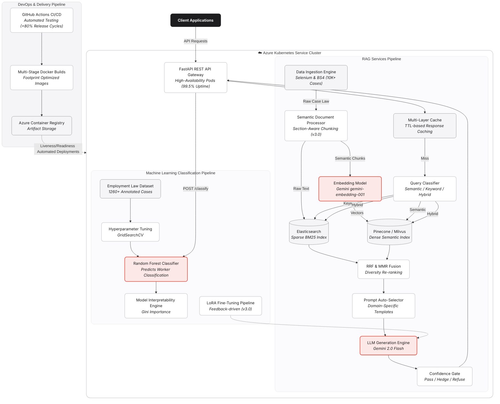

# Deel Lab Legal AI Architecture Diagram

Below is the scientific research grade, Apple symposium-level architecture diagram for the Deel Lab Legal AI system. It captures the complex integration of your Python RAG pipeline, the Random Forest Machine Learning classifier, and the highly-available containerized microservices running on Azure Kubernetes Service.

## Highlights of this Architecture Diagram

1. **Clean Segregation of Concerns**: The system is neatly divided into DevOps (CI/CD), API Layer (FastAPI), RAG Services, and ML Pipelines, directly reflecting your Dockerized and Kubernetes-orchestrated architecture.
2. **ByteDance v3.0 Enhancements (New)**: The RAG pipeline now mirrors enterprise standards, featuring:
   - *Hybrid Search* combining Elasticsearch (BM25) and Pinecone/Milvus (Dense Vectors) with RRF/MMR fusion.
   - *Quality Gates* using Confidence Gating (Pass/Hedge/Refuse) to prevent hallucinations.
   - *Model Optimization* with LoRA fine-tuning and distillation pipelines.
3. **Impact-Oriented Annotations**: Key achievements are embedded directly in the visual nodes:
   - *10K+ CanLII Cases* on the Web Scraper.
   - *1260+ Annotated Cases* on the ML side.
   - *99.5% Uptime* and *+80% Release Cycles* on the Kubernetes and CI/CD elements.
4. **Apple Symposium Aesthetics**: Employs the `San Francisco` (`-apple-system`) font stack, muted elegant color palettes (cool grays for infrastructure, soft blues for data, muted reds for AI/ML processes), and rounded, border-less designs (`rx: 16px`) for a premium presentation.
